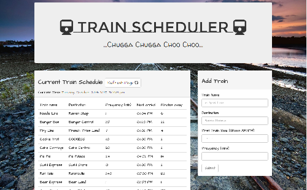

# Train_Scheduler

### Overview

This train schedule application incorporates Firebase to host arrival and departure data. The app retrieves and manipulates this information with Moment.js. This website will provide up-to-date information about various trains, namely their arrival times and how many minutes remain unil they arrive at their station.

### Instructions

1. Administrators should be able to submit user input (Train Name, Destination, First Train Time, Frequency)
2. The application will calculate when the next train will arrive
3. Users from many diffrent machines will be able o view same train times

### Tools Used

* Firebase
* Moment.js

### **[Demo](https://munmuney.github.io/Train_Scheduler/)
**	